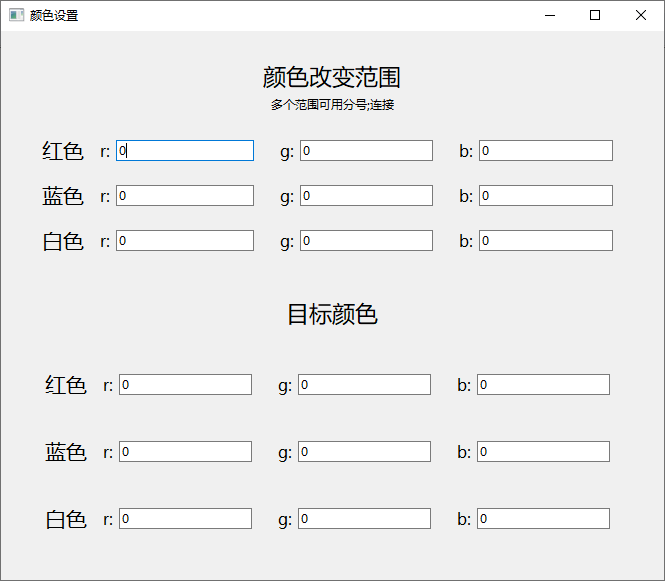
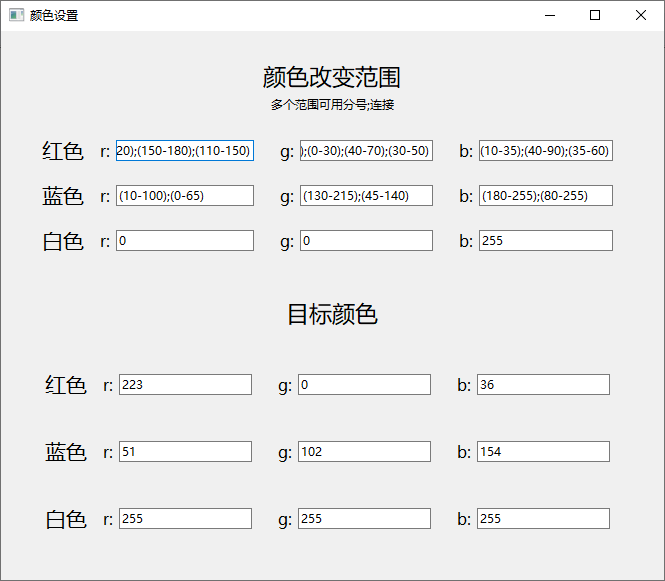

# 照片编辑器使用指南
## 一、用途
- 更改你的照片背景：自定义你要改变的颜色范围，将其变为指定颜色
- 后续可能会增加其他照片更多用法。
## 二、使用方法
1. 打开PictureWork.exe
2. 选择左侧的改背景
3. 选择照片路径或文件夹（如果选择文件夹，会自动处理该文件夹内所有文件）
4. 选择处理后的照片输出路径
5. **设置**

- **_初始设置见上，颜色改变范围有三种类型，以红色背景的照片为例：_** 假如有一张红底照片，但其底色的红色并不纯粹，有很多亮红色或者暗红色，那么可以用过ps等软件查看这些红色的范围，即查询需要改变的红色的范围。
- 如r在(160-200)，g在(35-65)，b在(36-75)之间，那么rgb为（165, 50, 38）的色块就在改变范围之内。
- 如果r有多个范围，可以通过分号连接，如r为(178-255);(120-185)，g为(35-65);(15-40)，b为(36-75);(15-40)，rgb的顺序一一对应，即第一个分号前的相互对应，第一个分号后的相互对应。
- 设置完改变范围后，程序会将改变范围内的所有颜色变为目标颜色。
- **目标颜色的设置**仅支持单个数字，如r为255，g为0，b为0。

- **_示例见上_** 
- _PS: 这个配置文件会被存在与exe程序同一目录下的ColorSet.csv中，无需每次重复配置。_
6. **运行**
- 选择你要将背景变成什么颜色（支持选择红色、蓝色、白色），即你设置中的对应颜色。但选择红色未必代表变成红色（比如你将红色的目标颜色设为(255, 255, 255)，那么得到的就是白色）
- 点击开始改变背景。
7. 编译注意事项
- 编译后需将./python/dist/changeBackground.exe放入主程序同一目录下，该程序是以该exe作为内核处理图片的